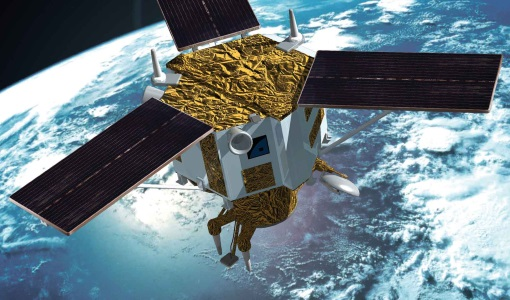
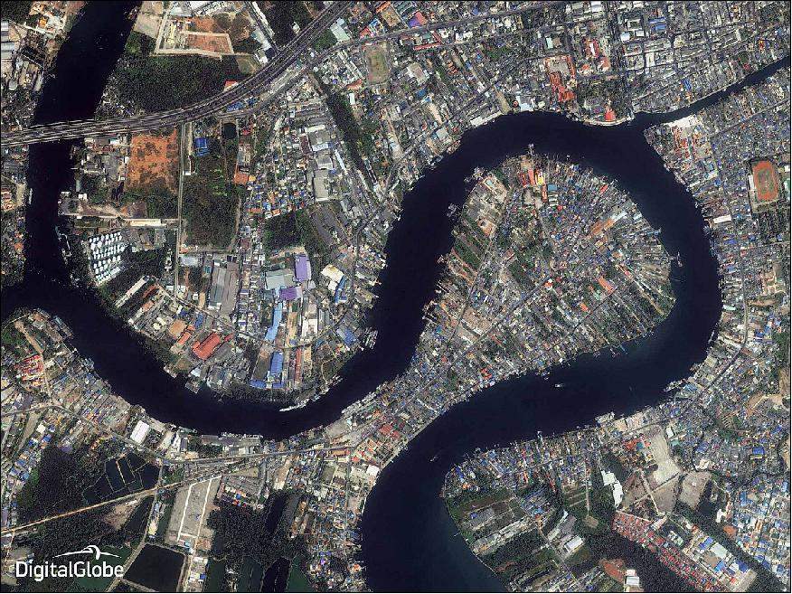

```{r setup, include=FALSE}
options(htmltools.dir.version = FALSE, htmltools.preserve.raw = FALSE)
```

class: left
.center[
# What is the IKONOS-2 satellite?
]

- IKONOS-2 was a satellite launched in 1999 and decommissioned in 2015
- It was the first commercial satellite to collect images with a resolution of 0.8m
- It was originally launched with another identical satellite (Ikonos-1) which failed to launch
- It lasted for 15 years despite having a design life of 7 years - the sensor was decommissioned when attempts to resolve an accuracy irregularity failed 

```{r echo=FALSE, out.width = "40%", fig.align='center', cache=FALSE, fig.cap="Source: BELSPO"}
 
```

(Belgian Earth Observation, 2023; eoPortal, 2012)
---
class: left
.center[
# Satellite details
]

## Spatial Resolution
- Panchromatic images - 0.8m
- Multispectral imagery - 3.2m 
- It was able to capture both of these image types at once as it carried an instrument called the Optical Sensor Assembly (OSA)

##Other details
- Revisiting frequency - 3 days
- Orbiting altitude - 681m
- Off-nadar pointing angle - 30 degrees


(eoPortal, 2012; Kramer, 2015)
---
class: center
# Ikonos-2 captured almost 600,000 public images during its time
It collected atmospheric and land data such as albedo, reflectance, cloud and weather information, vegetation and land surface
```{r echo=FALSE, out.width = "55%", fig.align='center', cache=FALSE, fig.cap="One of its last images was of the Tha Chin River in the Sumut Sakhon City, Thailand, December 2014 (Source: DigitalGlobe)"}


```
---
class:center
# Imagery examples 
.pull-left[
The aftermath of a tsunami in Banda Aceh, Indonesia, June 2013
Image name indonesia (Source: DigitalGlobe)
]
.pull-right[
Nisyros Island, a volcanic island in Greece, April 2000
Image name ikonos3 (Source: DigitalGlobe, National and Kapodistrian University of Athens)
]
---
class:left
.center[
#Significance of Ikonos-2

## At the time, the functioning of Ikonos-2 was unique in relation to other commercial satellites
]


- This is because it allowed each international association to have allocated time where they could task the satellite and receive the imagery instantly

- It was the first commercial imaging satellite with a spatial resolution of less than 1m

- The significance of this satellite is that it also represented the start of the production and use of earth observation data of a spatial resolution of 1 metre

---
# Studies which have used Ikonos-2 imagery

---
# Studies which have used Ikonos-2 imagery 2

---
class: left
.center[
#Reflection
##Ikonos-2 had a significant and lasting impact on Earth Observation data 
]
- Learning about this sensor has helped me to understand more about the history of remote sensing imagery, and how it has gained popularity and changed over the last 20 years

- It is interesting how at the time, remotely sensed images of 1 metre resolution were novel, compared to now  where they are far more common 

- I have also learnt through the applications section more ways in which sensor data can be used

- I also found it interesting how the sensor was able to continue for more than double its original design life, and how it can be assumed that more effort was not made in fixing it so it could function again was by that time others sensors already in use were sufficient enough that Ikonos-2 was not needed anymore 

---
class: left
.center[
#Reflection 2
]
- Ikonos-2 contributed to increasing work at the time in showing the value of remotely sensed data

- The owner of Ikonos-2, DigitalGlobe, are now able to use and are continuing to improve the use of remotely sensed data in disaster relief aid specifically at the moment 

- It seems to me that without the gains from Ikonos-2 this progress may have been a lot slower 

- Ikonos-2 also allowed earth observation data to be used in many new ways, however now there is an abundance of data

- In the future I think we must understand how this data can be used more efficiently and maximise its potnetial especially with regards to sustainability, climate change, population growth and to contribute to the SDGs

---
# References
Belgian Earth Observation (2023) ‘IKONOS-2’, available at: https://eo.belspo.be/en/satellites-and-sensors/ikonos-2 (accessed: 22.2.23) 

eoPortal (2012) 'Ikonos-2', available at: https://www.eoportal.org/satellite-missions/ikonos-2 (accessed: 22.2.23)

Kramer, M (2015) 'The life and death of Ikonos, a pioneering commercial satellite', available at: https://mashable.com/archive/ikonos-satellite-digitalglobe (accessed: 22.2.23)
